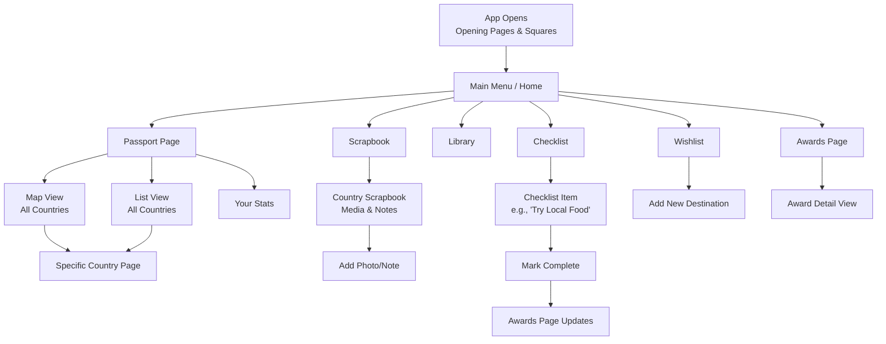

Mission Statement
Globe Expedition Journal empowers curious kids to become fearless, self-directed learners by transforming the world into their interactive classroom. We provide the digital toolkit for children to chart their own learning adventures, document discoveries, and visibly build their unique identity as explorers of knowledge.

The Passport & Map: Serves as the child's Personal Learning Atlas. It visually charts where their curiosity has taken them, showing progress not just in countries visited, but in topics explored. Each country "stamp" represents a chapter in their ongoing learning story.
The Scrapbook & Library: Functions as the child's Active Learning Journal and Resource Hub. This is where raw discovery (photos, notes from a museum visit) gets processed and connected to saved articles, facts, and prompts from the Library. It moves beyond a simple photo album to become an evidence-based portfolio of their learning journey.
The Checklist & Awards: Acts as the Guided Learning Pathway and Motivation Engine. Checklists aren't just travel to-dos; they are curated learning challenges (e.g., "Interview a local," "Identify three native plants"). Unlocking awards provides tangible, celebratory milestones that recognize the development of skills like observation, research, and cultural curiosity.
The Wishlist: Transforms from a simple travel dream list into a Child-Led Learning Plan. Kids can flag destinations or topics they want to explore next, using the app's tools to research and build a pre-learning checklist, fostering goal-setting and planning skills.
In essence, the app shifts from being a passive log of where you've been to an active platform for guiding, documenting, and celebrating what you've learned. It puts the child in the driver's seat of their own global education.
Based on the documents in the Google Drive folder you shared, here is the mission statement for the app and a detailed user journey flow. I analyzed each file, cross-referencing the flow documents with the mockups to provide a coherent picture.
2. Detailed User Journey & App Flow
   Primary Navigation & Core Pages
   The app is structured around a main menu, accessible from most screens, leading to six core sections:
   The Passport (Your Travel Hub)
   The Scrapbook (Your Memories)
   The Library (Your Knowledge Base)
   The Checklist (Your Travel To-Do's)
   The Awards Page (Your Achievements)
   The Wishlist (Your Travel Dreams)
   Here is a visual overview of how these core pages connect, followed by detailed interaction flows:

Interaction Flow: "Given → When → Then" Examples
Journey 1: Documenting a Visit to a Country
GIVEN a user is viewing their Passport's map view.
WHEN they tap on a country they have visited (e.g., France).
THEN they are taken to the Country Detail Page (from "Passport Page Purple" mockup). Here they can:
Log the date of visit.
See a summary of activities/stamps collected.
Tap a button like "Go to Scrapbook".
WHEN they tap "Go to Scrapbook".
THEN they navigate to the "Country Scrapbook Blue" page for that nation. Here they can:
View a gallery of past entries.
Tap an "Add+" button to create a new memory.
WHEN they tap "Add+".
THEN a modal or new screen opens, allowing them to add a photo, write notes, tag a location, and link this memory to a specific "stamp" or activity from the checklist (e.g., "Tried Croissant").
Journey 2: Completing a Travel Activity (Checklist to Awards)
GIVEN a user is on a trip and opens the "Checklist Page White".
WHEN they find an activity (e.g., "Visit a World Heritage Site" under the "Cultural" category) and tap it.
THEN the checklist item expands (as shown in mockups) to show details, notes, or an option to mark it complete.
WHEN they tap to mark it complete.
THEN:
The item is checked off their list.
A corresponding "stamp" is added to that country's page in their Passport.
Their progress bar(s) on the Awards Page (from "Awards and Completion Page Red") update automatically.
IF completing this item fulfills a collection (e.g., all "Cultural" items for France), THEN a new Award/Badge is unlocked and displayed prominently on the Awards Page.
Journey 3: Planning a Future Trip
GIVEN a user is dreaming of a future destination.
WHEN they go to the "Wishlist Page Yellow" and tap "Add a New Destination".
THEN they can search for and select a country.
WHEN a country is added to their Wishlist.
THEN:
It appears as a "planned" or "wishlisted" flag on their Passport map.
They can go to that country's page and pre-populate a future Scrapbook with links, plans, and a pre-trip checklist.
The Library section can be used to save relevant articles about that destination for later review.
Key Connections Between Features (How Everything Links)
Passport ↔ Scrapbook: The Passport is the index; every country links to its dedicated Scrapbook for memories.
Checklist ↔ Awards ↔ Passport: Completing checklist items grants stamps (in Passport) and progress toward awards.
Wishlist ↔ Passport ↔ Checklist: A wishlisted country can have its own pre-trip checklist and will appear visually distinct in the Passport.
Library ↔ All: Saved research in the Library can be linked to specific countries in the Passport, Scrapbook, or Wishlist.

